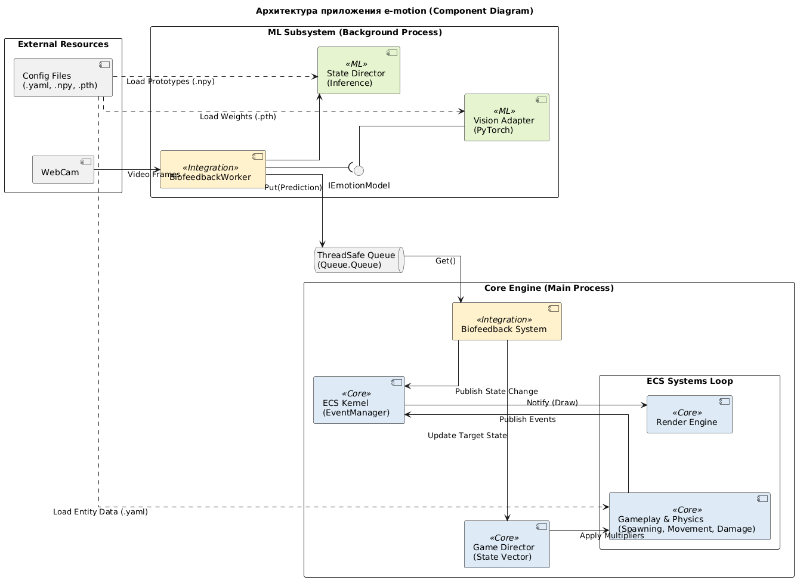
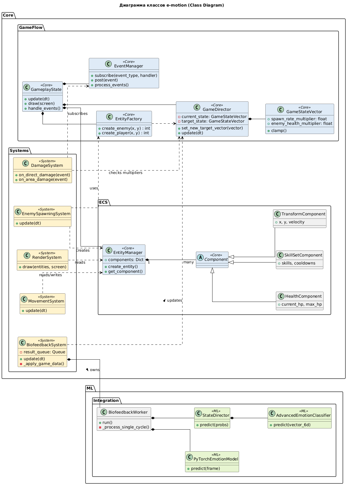

`e-motion` is a survival roguelike game (inspired by *Vampire Survivors*) that adapts its difficulty in real-time based on the player's emotional state. By analyzing facial expressions via a webcam, the game dynamically adjusts enemy spawn rates, speed, and health to keep the player in the "Flow" state.


---

## 🌟 Key Features

*   **Affective Computing:** Real-time facial emotion recognition (CNN) using a dedicated worker thread to ensure smooth 60 FPS gameplay.
*   **Dynamic Difficulty Adjustment (DDA):** The **Game Director** system interpolates game parameters based on a "State Vector" derived from your emotions.
*   **Custom ECS Architecture:** A high-performance, Data-Driven Entity-Component-System engine written in pure Python.
*   **Production-Ready ML:** Optimized inference pipeline using NumPy vectorization (replacing heavy Pandas operations).

---

## 🗺️ Architecture Guide (For Reviewers)

> **Note for Reviewers:** This project utilizes a hybrid architecture: a custom **ECS Engine** (Python) running on the main thread and an asynchronous **ML Subsystem** (PyTorch/OpenCV) running on a background thread.

### 1. High-Level Logic

To ensure the game renders at a stable 60 FPS while running heavy neural networks, the system is split into two independent control loops utilizing the **Producer-Consumer** pattern:

*   **Main Process (Game Loop):** Handles physics, rendering, and player input.
*   **Background Thread (ML Worker):** Handles video capture, CNN inference, and emotion analysis.

Communication between these layers happens via a thread-safe `queue.Queue`.

#### 🧩 Component Diagram
*The diagram below illustrates how the Core Engine is isolated from the ML Modules and how data flows through the queue.*



---

### 2. Repository Structure Walkthrough

The code is organized by layers of responsibility. Here is a guide to navigating the files:

#### 📁 Layer 1: The Game Core (`core/`)
This is the ECS engine implementation. It is strictly decoupled from ML libraries.

*   **Orchestrator:** `core/game_state/gameplay_state.py` — The entry point for the game session. It initializes the world and runs the system update loop.
*   **ECS Foundation:**
    *   `core/ecs/entity.py`: The `EntityManager`. Entities are just integer IDs.
    *   `core/ecs/component.py`: Pure Data Classes (e.g., `TransformComponent`, `HealthComponent`).
    *   `core/ecs/systems/`: Logic modules. Each system (e.g., `movement.py`, `combat.py`) handles a specific aspect of the game.
*   **Decoupling:** `core/event_manager.py` — An Event Bus allowing systems to communicate (e.g., Physics telling Audio about a collision) without direct dependencies.

#### 📁 Layer 2: ML Integration (`ml/` & `core/.../biofeedback.py`)
This layer connects the game to the neural networks.

*   **Async Worker:** `core/ecs/systems/biofeedback.py` — Contains the `BiofeedbackWorker` thread. It captures frames and feeds the Neural Network while the game draws the next frame.
*   **Abstraction:** `ml/wrapper.py` — Implements the **Adapter Pattern**. The `PyTorchEmotionModel` class hides the complexity of PyTorch tensors, exposing a simple `EmotionPrediction` object to the game engine.
*   **Optimization:** `ml/state/model/classifier.py` — A pure **NumPy** implementation of the state classification algorithm (refactored from slower Pandas-based research code) for zero-latency decision making.

#### 🧩 Class Diagram
*Illustrates the ECS structure, system hierarchy, and ML integration classes.*



#### 📁 Layer 3: Difficulty Management (`core/director.py`)
The "Brain" of the adaptive system.

*   `core/director.py` — The `GameDirector` class.
    *   Receives high-level data from ML (e.g., "Player is bored").
    *   Smoothly interpolates global game multipliers (Enemy Speed, Spawn Rate).
    *   `core/ecs/factory.py` reads these multipliers whenever a new enemy is spawned.

---

### 3. Interaction Flow

To understand how the files work together, consider these two scenarios:

**Scenario A: The Game Loop (Render)**
1.  `main.py` calls `GameplayState.update()`.
2.  `GameplayState` iterates through all Systems.
3.  `MovementSystem` updates coordinates in `TransformComponent`.
4.  `RenderSystem` reads coordinates and draws sprites.
    *   *Time taken: ~16ms.*

**Scenario B: The Adaptation Loop (Biofeedback)**
1.  **Background:** The `BiofeedbackWorker` captures a frame -> runs inference via `ml/wrapper.py` -> puts result into the `Queue`.
2.  **Main Thread:** The `BiofeedbackSystem` checks the `Queue`.
3.  **If data exists:** It updates the `GameDirector`.
4.  `GameDirector` shifts global multipliers.
5.  `EnemySpawningSystem` spawns the next enemy with updated stats.

---

## ⚙️ Installation

This project uses **[uv](https://github.com/astral-sh/uv)** for fast and reliable dependency management.

### 1. Clone the Repository
```bash
git clone https://github.com/DevDynastyOfProgrammers/e-motion
cd e-motion
```

### 2. Install Dependencies
Ensure you have `uv` installed. Then sync the environment:
```bash
uv sync
```

### 3. Environment Setup
Create a `.env` file in the root directory. You can copy the example config:
```bash
cp .env.example .env
```

### 4. ⚠️ Import Vision Model Weights
The pre-trained weights for the Convolutional Neural Network (CNN) are excluded from the repository due to file size limits.

1.  Obtain the file **`emotion_model.pth`** (from the provided cloud link/USB).
2.  Place it manually into the following directory:
    ```
    weights/emotion_model.pth
    ```
    *(Note: Ensure the filename is exactly `emotion_model.pth`).*

> **Note on State Models:** The State Director prototypes (`.npy` files) are lightweight and **are already included** in the repository. No generation steps are required.

---

## 🚀 How to Run

Once the dependencies are installed and the vision model is placed, start the game using:

```bash
uv run main.py
```

### Controls
*   **W / A / S / D**: Move Player.
*   **Gameplay**: Attacks are automatic. Survive as long as possible!

---

## 🧪 Technical Details

*   **Multithreading:** The ML inference runs in a separate `BiofeedbackWorker` thread to prevent the Global Interpreter Lock (GIL) from blocking the rendering loop.
*   **Safety:** The inference engine includes a "Safety Clamping" layer in `ml/state/inference.py` to ensure the neural network never outputs game-breaking multipliers (e.g., negative enemy health).
*   **Optimization:** Runtime state classification has been refactored from Pandas to pure NumPy, reducing inference latency significantly.

---

## 👥 Team & Roles

*   **Game Architect & Team Lead:** Dmitry Zharyj 
*   **ML Engineer (Vision):** Nikolai Smirnov 
*   **ML Engineer (Game Director):** Daniil Tropin 
*   **Data Engineer:** Artem Hazov